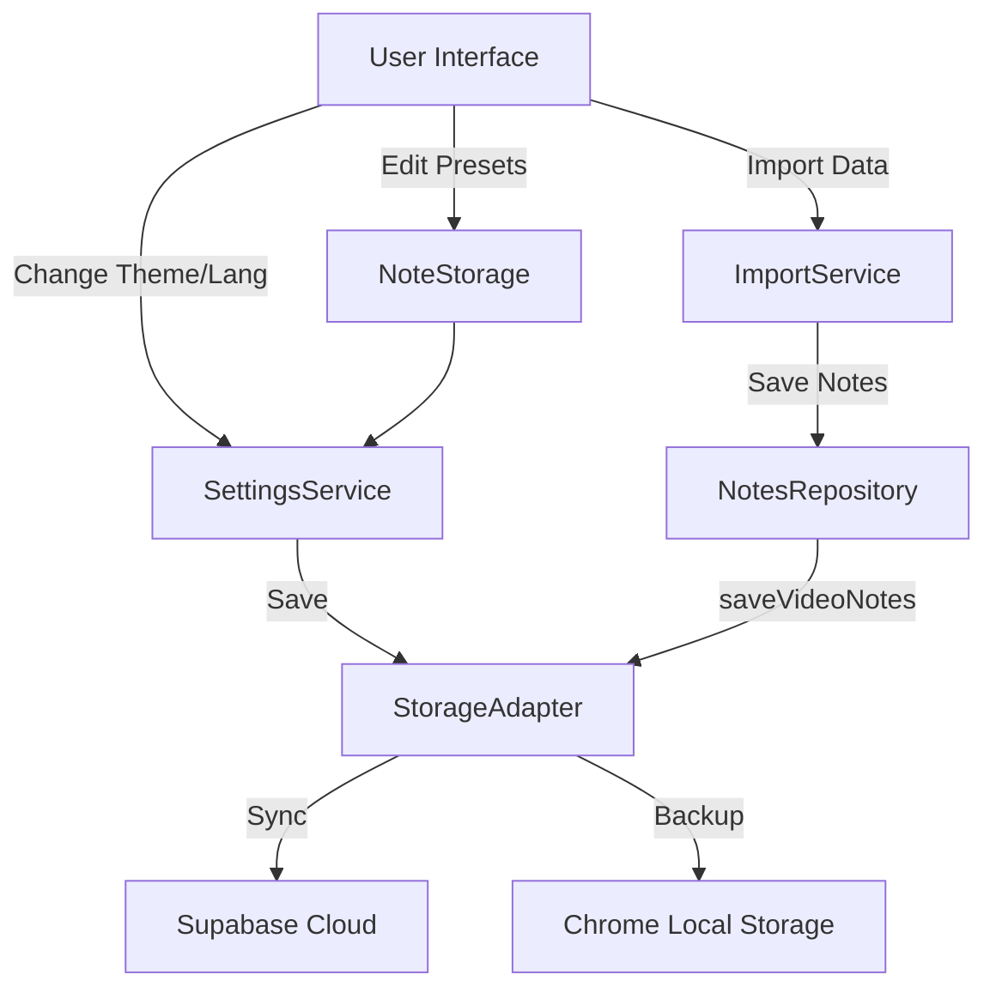

# VidScholar Cloud Sync & Settings Implementation Log
> **Date:** 2026-01-04
> **Focus:** Default Settings, Cloud Synchronization (Supabase), and Logic Consolidation.

## 1. Overview
This document summarizes the major refactoring and feature implementation session aimed at ensuring robust **Cloud Synchronization** for user settings, notes, and presets. The primary goal was to make `SettingsService` the single source of truth and ensure that all local changes (Theme, Language, Presets) are automatically synced to Supabase.

## 2. Key Features Implemented

### A. Self-Healing Default Settings
- **Problem:** New users or users with cleared data had missing settings in Supabase.
- **Solution:** Enhanced `SettingsService.initialize()`.
    - It now checks Supabase for existing settings.
    - If **not found**, it automatically provisions the database with `DEFAULT_SETTINGS` (including rich defaults for `videoGroups` and `presets` loaded from `config.json`).

### B. Centralized Settings Synchronization
- **Problem:** Changing Theme or Language was only saving locally via legacy storage calls.
- **Solution:** Rerouted all state changes to `SettingsService`.
    - **ThemeService:** Now calls `settingsService.update({ theme })`.
    - **LanguageService:** Now calls `settingsService.update({ locale })`.
    - **NoteStorage (Presets):** Now uses `settingsService.update({ presets })` instead of scattered `chrome.storage` keys.

### C. Import/Export & Repository Logic
- **Problem:** `ImportService` and `ExportService` were using outdated `SettingsRepository` and `PresetsRepository` that disconnected from the cloud sync logic.
- **Solution:** 
    - Refactored `ImportService` to use `settingsService` for importing groups and templates.
    - Refactored `ExportService` to read latest data from `settingsService`.
    - Updated `NotesRepository.saveNotes` to use `StorageAdapter.saveVideoNotes`, ensuring that imported notes are pushed to the cloud.

## 3. Modified Architecture

### Data Flow Diagram (New)

## 4. Modified Files

| File | Change Summary |
|------|----------------|
| `src/services/SettingsService.ts` | Added self-healing initialization and populated defaults from `config.json`. |
| `src/services/ThemeService.ts` | Integrated with `SettingsService` for cloud sync. |
| `src/services/LanguageService.ts` | Integrated with `SettingsService` for cloud sync. |
| `src/classes/NoteStorage.ts` | Refactored Presets management to use `SettingsService`. |
| `src/storage/NotesRepository.ts` | Updated to use `saveVideoNotes` for proper cloud synchronization. |
| `src/io/ImportService.ts` | Replaced legacy repositories with modern Services. |
| `src/io/ExportService.ts` | Replaced legacy repositories with modern Services. |
| `src/components/modals/TemplateEditor.ts` | Removed direct `chrome.storage` calls. |

## 5. Deprecated / Unused Files
The following files are technically obsolete after this refactor and can be safely removed in a future cleanup:
- `src/storage/SettingsRepository.ts`
- `src/storage/PresetsRepository.ts`

## 6. How to Verify
1.  **New User:** Log in with a fresh account (or delete row in Supabase). The app should auto-create default settings.
2.  **Theme Sync:** Change theme on one device -> Reload on another -> Theme should update.
3.  **Presets:** Add a template -> Check Supabase `settings` column -> It should appear there.
4.  **Import:** Import a `.vsbak` file -> Check Supabase -> Notes and Groups should be synced.
