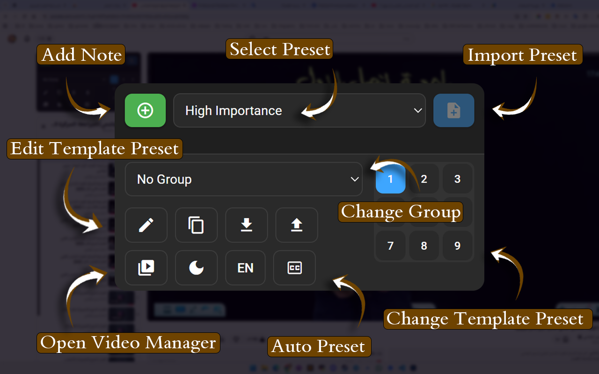
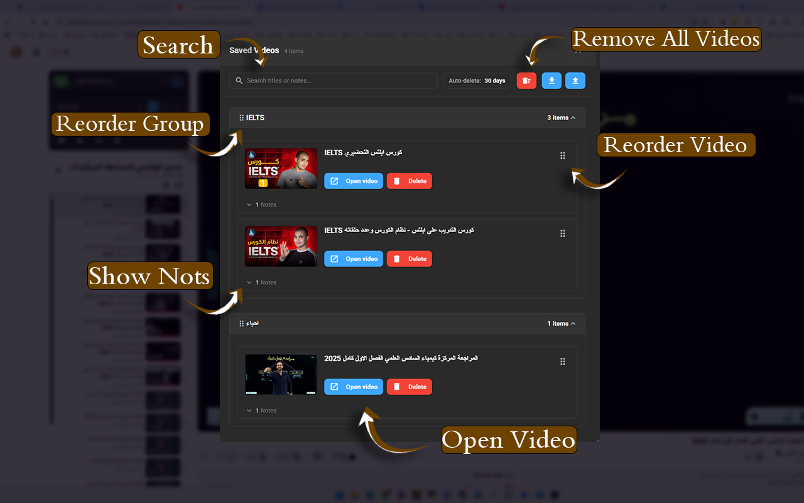

# Visual Assets

> **Visual assets, diagrams, and screenshots for VidScholar documentation**

This directory contains visual assets used throughout the VidScholar project documentation.

---

## Screenshots

### Asset 1

### Asset 2

### Asset 3

### Asset 4

### Asset 5

---

## Icons

### Red Arrow Icon

---

## Miscellaneous

### Asset 7

---

## Usage Guidelines

When adding new assets:
1. Use descriptive, kebab-case file names
2. Prefer PNG for screenshots and SVG for icons
3. Optimize images before committing (compress PNGs)
4. Update this index when adding new assets

---

*Last updated: 2026-01-10*
