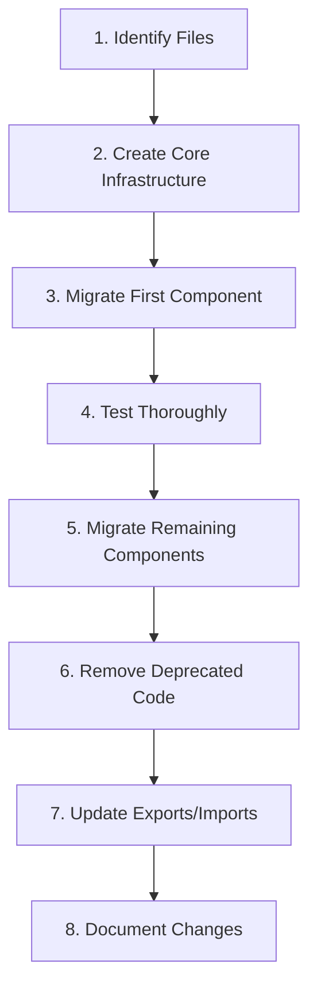

# VidScholar Complete Refactoring Prompt

> **Purpose:** This document provides a complete, precise, and actionable refactoring plan for the VidScholar codebase. It is designed to be executed by an AI agent to systematically refactor all 8 identified zones.

---

## 1️⃣ General Instructions

### Code Cleanup Mandates
- **Remove** all unused, redundant, or obsolete code and files
- **Delete** dead code paths, commented-out blocks, and unreachable logic
- **Merge** duplicate logic into centralized, reusable utilities
- **Consolidate** CSS classes and styling rules where duplication exists

### Quality Objectives
- **Improve maintainability** by reducing cognitive load and file count
- **Enhance readability** through consistent patterns and naming
- **Increase testability** by adding proper seams for dependency injection
- **Preserve existing functionality** unless explicitly marked obsolete

### Cleanup Patterns (Apply Everywhere)
```typescript
// Pattern: Listener cleanup
const listener = () => { /* ... */ };
service.addListener(listener);
// On destroy:
service.removeListener(listener);

// Pattern: Timer cleanup
const timerId = setTimeout(() => { /* ... */ }, delay);
// On destroy:
clearTimeout(timerId);

// Pattern: DOM cleanup
const element = document.createElement('div');
container.appendChild(element);
// On destroy:
element.remove();

// Pattern: Event cleanup
const handler = (e: Event) => { /* ... */ };
element.addEventListener('click', handler);
// On destroy:
element.removeEventListener('click', handler);
```

### TypeScript Conventions
- Use strict typing; avoid `any` where possible
- Prefer interfaces over type aliases for object shapes
- Export types separately from implementations
- Use `readonly` for immutable properties
- Prefer `const` assertions for literal types

---

## 2️⃣ Refactoring Zones (01–08) with Detailed Goals

---

### Zone 01: Storage & Data Layer Unification

**Current State:**
- 5 files with overlapping persistence logic (~2,600 lines total):
  - `src/classes/NoteStorage.ts` (589 lines)
  - `src/storage/NotesRepository.ts` (703 lines)
  - `src/storage/StorageAdapter.ts` (554 lines)
  - `src/services/SupabaseService.ts` (441 lines)
  - `src/services/BackupService.ts` (318 lines)

**Problems to Fix:**
- `saveNotes()` implemented 4 times with slight variations
- `loadAllVideos()` implemented 3 times
- Two separate cache classes (`NoteCache`, `NotesCache`) with identical TTL logic
- Merge algorithm exists in both `NotesRepository` and `ShareService`
- No clear "source of truth" for persistence operations

**Refactoring Goals:**
1. Create unified `src/data/DataLayer.ts` facade
2. Extract `src/data/cache/TTLCache.ts` generic utility
3. Consolidate adapters into `src/data/adapters/LocalStorage.ts` and `CloudStorage.ts`
4. Create `src/data/sync/SyncEngine.ts` for local↔cloud synchronization
5. Move backup logic to `src/data/backup/BackupManager.ts`

**Files to Delete/Deprecate:**
- Mark `NoteStorage.ts` as deprecated (keep as thin wrapper)
- Mark `NotesRepository.ts` as deprecated
- Merge `NoteCache.ts` into generic `TTLCache.ts`

**Target Structure:**
```
src/data/
├── DataLayer.ts           # Public facade
├── DataLayerTypes.ts      # Type definitions
├── adapters/
│   ├── LocalStorage.ts    # Chrome storage operations
│   └── CloudStorage.ts    # Supabase operations
├── cache/
│   └── TTLCache.ts        # Generic TTL cache
├── sync/
│   ├── SyncEngine.ts      # Sync orchestration
│   └── ConflictResolver.ts # Merge strategies
└── backup/
    └── BackupManager.ts   # Backup/restore logic
```

**Estimated Impact:**
- Lines deleted: ~1,200
- Lines added: ~600
- Net reduction: ~600 lines

---

### Zone 02: Modal Dialog Framework

**Current State:**
- 5 modal files with duplicated boilerplate (~2,150 lines total):
  - `src/components/modals/ConfirmDialog.ts` (80 lines)
  - `src/components/modals/PromptDialog.ts` (85 lines)
  - `src/components/modals/ImportDecisionManager.ts` (476 lines)
  - `src/components/modals/TemplateEditor.ts` (601 lines)
  - `src/components/modals/VideoManager.ts` (905 lines)

**Problems to Fix:**
- Overlay creation logic repeated 5 times
- ESC key handler repeated 5 times
- Click-outside-to-close repeated 5 times
- Direction handling repeated 4 times (some missing cleanup)
- No focus trap for accessibility

**Refactoring Goals:**
1. Create `src/components/modals/core/ModalFactory.ts`
2. Create `src/components/modals/core/ModalOverlay.ts`
3. Create `src/components/modals/core/ModalKeyboard.ts` (ESC, focus trap)
4. Create `src/components/modals/core/ModalAccessibility.ts`
5. Simplify each modal to content-only code

**Core Modal Factory Interface:**
```typescript
interface ModalConfig {
  id: string;
  className?: string;
  size?: 'sm' | 'md' | 'lg' | 'xl' | 'fullscreen';
  closeOnEscape?: boolean;
  closeOnClickOutside?: boolean;
  direction?: 'auto' | 'ltr' | 'rtl';
}

function createModal<T>(config: ModalConfig): {
  overlay: HTMLElement;
  container: HTMLElement;
  close: (result: T) => void;
  destroy: () => void;
}
```

**Target Structure:**
```
src/components/modals/
├── core/
│   ├── ModalFactory.ts
│   ├── ModalOverlay.ts
│   ├── ModalKeyboard.ts
│   ├── ModalAccessibility.ts
│   └── types.ts
├── primitives/
│   ├── ConfirmModal.ts    # ~30 lines (was 80)
│   └── PromptModal.ts     # ~40 lines (was 85)
└── composed/
    ├── VideoManager/
    ├── TemplateEditor/
    └── ImportDecision/
```

**Estimated Impact:**
- Lines deleted: ~400 (boilerplate)
- Lines added: ~200 (core infrastructure)
- Net reduction: ~200 lines
- Accessibility: Focus trap added

---

### Zone 03: Service Singleton Cleanup

**Current State:**
- Unused DI container: `src/services/di/` (213 lines, never used)
- 10 services with inconsistent singleton patterns
- Some use `getInstance()`, some use `new Service()` export
- `registerServices()` exists but is never called

**Problems to Fix:**
- Dead code in DI container
- Inconsistent initialization (eager vs lazy)
- Mixed class/instance exports
- No `resetInstance()` for testing
- Potential circular dependencies

**Refactoring Goals:**
1. **Delete** `src/services/di/Container.ts` (145 lines)
2. **Delete** `src/services/di/services.ts` (68 lines)
3. **Delete** `src/services/di/index.ts`
4. Standardize all services to `getInstance()` pattern
5. Add `resetInstance()` to all services for testing
6. Create `src/services/registry.ts` for initialization order

**Singleton Template to Apply:**
```typescript
class ExampleService {
  private static instance: ExampleService | null = null;
  
  private constructor() { }
  
  static getInstance(): ExampleService {
    if (!ExampleService.instance) {
      ExampleService.instance = new ExampleService();
    }
    return ExampleService.instance;
  }
  
  static resetInstance(): void {
    ExampleService.instance = null;
  }
  
  async initialize(): Promise<void> { }
}

export const exampleService = ExampleService.getInstance();
export { ExampleService };
```

**Services to Update:**
- `SettingsService.ts` - change from `new SettingsService()` to `getInstance()`
- `BackupService.ts` - change from `new BackupService()` to `getInstance()`
- `EncryptionService.ts` - change from `new EncryptionService()` to `getInstance()`
- All services - add `resetInstance()` method

**Estimated Impact:**
- Lines deleted: ~213 (dead DI code)
- Lines added: ~50 (registry + resetInstance methods)
- Net reduction: ~163 lines

---

### Zone 04: Import/Export Consolidation

**Current State:**
- 3 locations handling file I/O:
  - `src/io/ExportService.ts` (454 lines)
  - `src/io/ImportService.ts` (583 lines)
  - `src/services/ShareService.ts` (429 lines, partial overlap)
- `BackupService.ts` has its own import/export methods

**Problems to Fix:**
- File picker logic implemented 3 times
- FileReader logic implemented 3 times
- Download logic implemented 3 times
- Different version strings (`1.0.0` vs `2.0.0`)
- Validation logic duplicated

**Refactoring Goals:**
1. Create `src/io/core/filePicker.ts`
2. Create `src/io/core/fileReader.ts`
3. Create `src/io/core/fileDownload.ts`
4. Create `src/io/version.ts` with single `EXPORT_VERSION`
5. Create `src/io/formats/FormatRegistry.ts` for pluggable formats
6. Simplify `ShareService` to delegate to IO services

**Core Utilities to Create:**
```typescript
// src/io/core/filePicker.ts
export async function pickFile(accept: string): Promise<File | null>;

// src/io/core/fileReader.ts
export async function readFileAsText(file: File): Promise<string>;
export async function readFileAsArrayBuffer(file: File): Promise<ArrayBuffer>;

// src/io/core/fileDownload.ts
export async function downloadAsFile(
  content: string | Blob,
  filename: string,
  mimeType: string
): Promise<void>;
```

**Target Structure:**
```
src/io/
├── core/
│   ├── filePicker.ts
│   ├── fileReader.ts
│   ├── fileDownload.ts
│   └── types.ts
├── formats/
│   ├── FormatRegistry.ts
│   ├── json/
│   ├── markdown/
│   └── text/
├── version.ts           # Single EXPORT_VERSION
├── ExportService.ts     # Simplified
├── ImportService.ts     # Simplified
└── index.ts
```

**Estimated Impact:**
- Lines deleted: ~500
- Lines added: ~200
- Net reduction: ~300 lines

---

### Zone 05: UI Component Infrastructure

**Current State:**
- `src/components/ui/Button.ts` - main factory
- `src/utils/ui.ts` - `styleToolbarButton()` with inline styles
- Scattered button creation with post-creation class additions

**Problems to Fix:**
- `createButton()` doesn't cover all use cases (icon-only, loading state)
- Inline styles in `styleToolbarButton()` should be CSS
- No standardized loading/disabled state API
- Missing button variants: `icon`, `ghost`, `link`, `timestamp`

**Refactoring Goals:**
1. Extend `createButton()` with new options interface
2. Add `size`, `loading`, `disabled`, `tooltip` support
3. Create `setButtonLoading()`, `setButtonDisabled()` utilities
4. Create `IconButton.ts` for icon-only shorthand
5. Delete `styleToolbarButton()` from `utils/ui.ts`
6. Move inline styles to CSS classes

**Enhanced Button Interface:**
```typescript
interface ButtonOptions {
  icon?: string;
  text?: string;
  variant?: 'default' | 'primary' | 'danger' | 'success' | 'ghost' | 'icon' | 'link';
  size?: 'sm' | 'md' | 'lg';
  loading?: boolean;
  disabled?: boolean;
  tooltip?: string;      // i18n key
  ariaLabel?: string;
  onClick?: (e: MouseEvent) => void;
}

function createButton(options: ButtonOptions): HTMLButtonElement;

// Backward compatible overload
function createButton(
  icon: string | null,
  text: string | null,
  onClick: (e: MouseEvent) => void,
  color?: string | null,
  variant?: 'default' | 'primary' | 'danger' | 'success'
): HTMLButtonElement;
```

**State Utilities:**
```typescript
function setButtonLoading(button: HTMLButtonElement, loading: boolean): void;
function setButtonDisabled(button: HTMLButtonElement, disabled: boolean): void;
```

**Estimated Impact:**
- Lines deleted: ~50 (inline styles)
- Lines added: ~100 (enhanced button + utilities)
- Net change: +50 lines (but better DX)

---

### Zone 06: Drag & Drop Behavior Extraction

**Current State:**
- Sortable.js setup repeated 3 times:
  - `VideoManager.ts` (lines 435-491)
  - `TemplateEditor.ts` groups (lines 187-242)
  - `TemplateEditor.ts` presets (lines 389-441)
- Each setup: ~55 lines × 3 = ~165 lines of duplication

**Problems to Fix:**
- Drop indicator creation logic copied 3 times
- Drag cleanup function copied 3 times
- Drop zone detection logic copied 3 times
- Different class names for same visual behavior

**Refactoring Goals:**
1. Create `src/components/ui/Sortable/createSortableList.ts`
2. Create `src/components/ui/Sortable/dropIndicators.ts`
3. Create `src/components/ui/Sortable/dragHandlers.ts`
4. Create unified `sortable.css` for shared styles
5. Replace 3 implementations with single factory calls

**Sortable Factory Interface:**
```typescript
interface SortableConfig {
  container: HTMLElement;
  itemSelector: string;
  dropIndicatorClass?: string;
  animation?: number;
  ghostClass?: string;
  onReorder: (newOrder: string[]) => Promise<void>;
  getItemId: (item: HTMLElement) => string;
}

function createSortableList(config: SortableConfig): () => void; // Returns cleanup
```

**Usage After Refactoring:**
```typescript
// Before: ~60 lines
new Sortable(container, {
  animation: 150,
  ghostClass: 'sortable-ghost',
  onStart: () => { /* 30+ lines */ },
  onEnd: () => { /* 20+ lines */ }
});

// After: ~8 lines
const cleanup = createSortableList({
  container,
  itemSelector: '.group-item',
  getItemId: item => item.dataset.groupId,
  onReorder: async (ids) => {
    await settingsService.saveVideoGroupsOrder(ids);
  }
});
```

**Target Structure:**
```
src/components/ui/Sortable/
├── createSortableList.ts
├── dropIndicators.ts
├── dragHandlers.ts
├── types.ts
└── sortable.css
```

**Estimated Impact:**
- Lines deleted: ~350
- Lines added: ~100
- Net reduction: ~250 lines

---

### Zone 07: Video Context & YouTube Utilities

**Current State:**
- `src/utils/video.ts` (247 lines) - Main utilities
- Direct DOM queries scattered across components
- No caching for frequently-accessed video metadata
- Magic selectors hardcoded in multiple files

**Problems to Fix:**
- No caching; every call queries DOM
- Selectors scattered and duplicated
- No YouTube navigation event handling
- Inconsistent error handling (silent failures)

**Refactoring Goals:**
1. Create `src/utils/youtube/selectors.ts` - Central selector registry
2. Create `src/utils/youtube/VideoContext.ts` - Cached singleton
3. Create `src/utils/youtube/TranscriptHelper.ts` - Transcript logic
4. Update components to use `videoContext` instead of direct DOM
5. Add YouTube navigation event handling for cache invalidation

**Selector Registry:**
```typescript
// src/utils/youtube/selectors.ts
export const YOUTUBE_SELECTORS = {
  videoPlayer: 'video',
  videoTitle: [
    'h1.ytd-video-primary-info-renderer',
    'ytd-video-primary-info-renderer #title'
  ],
  channelName: [
    '#owner #channel-name a',
    'ytd-video-owner-renderer #channel-name a',
    '#upload-info #channel-name a'
  ],
  transcriptButton: 'button[aria-label="Show transcript"]',
  transcriptPanel: 'ytd-engagement-panel-section-list-renderer[target-id="engagement-panel-searchable-transcript"]'
} as const;
```

**VideoContext Interface:**
```typescript
class VideoContext {
  private cache: Map<string, { value: any; timestamp: number }>;
  private readonly CACHE_TTL = 1000; // 1 second
  
  getVideoId(): string | null;
  getVideoTitle(): string;
  getChannelName(): string;
  getChannelId(): string;
  getPlayer(): HTMLVideoElement | null;
  getCurrentTime(): number;
  seekTo(seconds: number): void;
  seekToTimestamp(timestamp: string): void;
  invalidateCache(): void;
}

export const videoContext = VideoContext.getInstance();
```

**Target Structure:**
```
src/utils/youtube/
├── selectors.ts
├── VideoContext.ts
├── TranscriptHelper.ts
├── YouTubeEvents.ts
└── index.ts

src/utils/video.ts  # DEPRECATED: Re-exports from youtube/
```

**Estimated Impact:**
- Lines deleted: ~100 (scattered queries)
- Lines added: ~150 (centralized utilities)
- Net change: +50 lines (but better architecture)
- Performance: DOM queries cached

---

### Zone 08: Localization & RTL Direction Handling

**Current State:**
- `LanguageService.ts` handles translations and direction
- Direction setup pattern repeated 10+ times
- Local `t()` helper defined in `TemplateEditor.ts` only
- Some modals missing direction listeners
- Memory leaks from unremoved listeners

**Problems to Fix:**
- `setAttribute('dir', ...)` pattern duplicated 10+ times
- Direction listener pattern duplicated 5+ times
- `ConfirmDialog.ts` and `PromptDialog.ts` don't update direction on change
- No automatic cleanup for direction listeners

**Refactoring Goals:**
1. Add `t(key, fallback?)` method to `LanguageService`
2. Add `applyDirection(element, options)` method with auto-cleanup
3. Update `ConfirmDialog.ts` to use `applyDirection()`
4. Update `PromptDialog.ts` to use `applyDirection()`
5. Remove local `t()` helper from `TemplateEditor.ts`
6. Audit all components for listener cleanup

**Enhanced LanguageService:**
```typescript
class LanguageService {
  // Existing
  translate(key: string): string;
  getCurrentDirection(): 'ltr' | 'rtl';
  addDirectionListener(listener: () => void): void;
  removeDirectionListener(listener: () => void): void;
  
  // NEW: Translation with fallback
  t(key: string, fallback?: string): string {
    const translation = this.translate(key);
    return (translation && translation !== key) ? translation : (fallback || key);
  }
  
  // NEW: Auto-cleanup direction handler
  applyDirection(element: HTMLElement, options?: { trackChanges?: boolean }): () => void {
    element.setAttribute('dir', this.getCurrentDirection());
    
    if (options?.trackChanges === false) return () => {};
    
    const listener = () => {
      element.setAttribute('dir', this.getCurrentDirection());
    };
    this.addDirectionListener(listener);
    
    return () => this.removeDirectionListener(listener);
  }
}
```

**Usage After Refactoring:**
```typescript
// Before: 6 lines, no cleanup
container.setAttribute('dir', languageService.getCurrentDirection());
const updateDirection = () => {
  container.setAttribute('dir', languageService.getCurrentDirection());
};
languageService.addDirectionListener(updateDirection);

// After: 1 line, automatic cleanup
const cleanupDirection = languageService.applyDirection(container);
// On destroy:
cleanupDirection();
```

**Estimated Impact:**
- Lines deleted: ~100 (duplicated patterns)
- Lines added: ~30 (LanguageService methods)
- Net reduction: ~70 lines
- Memory leaks: Fixed

---

## 3️⃣ Implementation Steps (Per Zone)

### Standard Workflow for Each Zone



### Detailed Steps

#### Step 1: Identify All Related Files
```bash
# Example for Zone 01 (Storage)
grep -r "saveNotes\|loadNotes\|StorageAdapter\|NotesRepository" src/ --include="*.ts"
```

#### Step 2: Create Core Infrastructure
- Build new abstractions without touching existing code
- Ensure new code compiles and passes type checking
- Write unit tests for new utilities

#### Step 3: Migrate First Component
- Pick smallest/simplest consumer
- Replace old patterns with new utilities
- Verify functionality unchanged

#### Step 4: Test Thoroughly
- Run existing tests (if any)
- Manual smoke test:
  - [ ] Create note → save → reload → note persists
  - [ ] Open modal → ESC closes → no errors
  - [ ] Switch language → UI updates correctly
  - [ ] Export → Import → data intact

#### Step 5: Migrate Remaining Components
- Apply same pattern to other consumers
- Batch similar changes together

#### Step 6: Remove Deprecated Code
- Delete files marked for deletion
- Remove unused functions
- Clean up orphaned imports

#### Step 7: Update Exports/Imports
- Update barrel exports (`index.ts` files)
- Ensure backward-compatible re-exports where needed
- Add deprecation warnings if keeping old paths

#### Step 8: Document Changes
- Update this document with actual results
- Add entries to CHANGELOG.md
- Update architecture documentation

---

## 4️⃣ Expected Output

### Deliverables Per Zone

For each zone, produce:

1. **Refactored Code**
   - New/updated TypeScript files
   - Updated CSS files (if applicable)
   - Updated barrel exports

2. **Deleted Files List**
   ```
   Zone 03:
   - DELETED: src/services/di/Container.ts
   - DELETED: src/services/di/services.ts
   - DELETED: src/services/di/index.ts
   ```

3. **Summary Table**
   | Zone | Lines Deleted | Lines Added | Net Change | Key Improvements |
   |------|---------------|-------------|------------|------------------|
   | 01   | 1,200         | 600         | -600       | Single data layer |
   | 02   | 400           | 200         | -200       | Modal core + a11y |
   | 03   | 213           | 50          | -163       | No dead code |
   | 04   | 500           | 200         | -300       | Unified I/O |
   | 05   | 50            | 100         | +50        | Better button API |
   | 06   | 350           | 100         | -250       | Single Sortable |
   | 07   | 100           | 150         | +50        | Cached video context |
   | 08   | 100           | 30          | -70        | No memory leaks |

4. **Overall Impact**
   - **Total Lines Reduced:** ~1,500–2,000
   - **Complexity:** Reduced (fewer entry points, clearer ownership)
   - **Memory:** Improved (proper cleanup patterns)
   - **Extensibility:** Improved (pluggable formats, factory patterns)
   - **Testability:** Improved (resetInstance, dependency injection points)

---

## 5️⃣ Constraints

### Must Preserve
- All existing user-facing functionality
- Data format compatibility (import/export)
- Keyboard shortcuts and accessibility features
- Theme switching behavior
- RTL language support

### Backward Compatibility Requirements
- Old import paths should work (via re-exports) during transition
- Deprecation warnings in console for old APIs
- Keep transition shims for at least 1 release cycle

### TypeScript Requirements
- Strict mode compliance
- No `any` in new code (existing `any` can remain)
- Proper type exports for consumers
- JSDoc comments for public APIs

### Edge Case Handling
- YouTube DOM structure changes → Graceful fallback with console warning
- Empty lists → No errors, sensible defaults
- RTL content with LTR elements → Proper isolation
- Offline operation → Queue and sync when online
- Extension context invalidation → Emergency backup to localStorage

### Cleanup Requirements
All new code must:
- Return cleanup functions where applicable
- Remove event listeners on component destruction
- Clear timeouts/intervals on component destruction
- Avoid global state pollution

---

## 6️⃣ Execution Order

### Phase 1: Quick Wins (Day 1)
```
✅ Zone 03: Delete unused DI container (213 lines, no dependencies)
✅ Zone 08: Add applyDirection() helper (low risk, immediate benefit)
```

### Phase 2: Isolated Utilities (Days 2-3)
```
✅ Zone 06: Extract Sortable abstraction (isolated, clear boundaries)
✅ Zone 05: Enhance button factory (additive, backward compatible)
```

### Phase 3: Core Infrastructure (Days 4-7)
```
✅ Zone 07: Create VideoContext (foundation for other changes)
✅ Zone 04: Extract IO primitives (foundation for Zone 01)
```

### Phase 4: Major Refactoring (Days 8-14)
```
✅ Zone 02: Create Modal Core (high impact, medium complexity)
✅ Zone 01: Unify Storage layer (highest complexity, most impact)
```

---

## 7️⃣ Validation Checklist

### After Each Zone

- [ ] Extension loads without console errors
- [ ] All existing features work:
  - [ ] Add note at timestamp
  - [ ] Edit note text
  - [ ] Delete note
  - [ ] Export notes (JSON, Markdown)
  - [ ] Import notes
  - [ ] Open VideoManager
  - [ ] Open TemplateEditor
  - [ ] Switch theme
  - [ ] Switch language
  - [ ] Drag-reorder items
- [ ] RTL layout correct in Arabic
- [ ] Memory stable (no growing listener counts)
- [ ] TypeScript compiles without errors
- [ ] No regressions in existing tests

### Final Validation

- [ ] Full extension reload test
- [ ] Fresh install test (no existing data)
- [ ] Upgrade test (existing data migration)
- [ ] Performance: No noticeable slowdown
- [ ] Bundle size: Not significantly increased

---

## 8️⃣ File Reference Quick Lookup

### Files to DELETE
```
src/services/di/Container.ts
src/services/di/services.ts
src/services/di/index.ts
```

### Files to DEPRECATE (keep but mark deprecated)
```
src/classes/NoteStorage.ts
src/storage/NotesRepository.ts
src/utils/video.ts (re-export from youtube/)
```

### Files to CREATE
```
src/data/DataLayer.ts
src/data/cache/TTLCache.ts
src/data/adapters/LocalStorage.ts
src/data/adapters/CloudStorage.ts
src/components/modals/core/ModalFactory.ts
src/components/modals/core/ModalOverlay.ts
src/components/modals/core/ModalKeyboard.ts
src/components/ui/Sortable/createSortableList.ts
src/utils/youtube/selectors.ts
src/utils/youtube/VideoContext.ts
src/io/core/filePicker.ts
src/io/core/fileReader.ts
src/io/core/fileDownload.ts
src/services/registry.ts
```

### Files to MODIFY
```
src/services/LanguageService.ts (add t(), applyDirection())
src/components/ui/Button.ts (enhance with new options)
src/components/modals/ConfirmDialog.ts (use applyDirection())
src/components/modals/PromptDialog.ts (use applyDirection())
src/components/modals/VideoManager.ts (use Sortable factory)
src/components/modals/TemplateEditor.ts (use Sortable factory, remove local t())
src/io/ExportService.ts (use core utilities)
src/io/ImportService.ts (use core utilities)
src/services/ShareService.ts (delegate to IO services)
src/services/SettingsService.ts (standardize singleton)
src/services/BackupService.ts (standardize singleton)
src/services/EncryptionService.ts (standardize singleton)
```

---

*Generated: 2026-01-08*
*Based on: VidScholar Refactoring Analysis v1.0*
